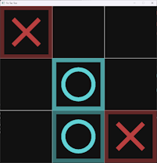
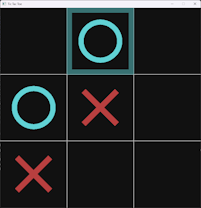
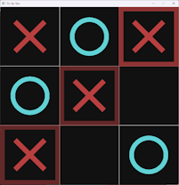

# SDL2 Tic Tac Toe game

Making a small [Tic-Tac-Toe](https://en.wikipedia.org/wiki/Tic-tac-toe) game, inspired by this [video](https://www.youtube.com/watch?v=gCVMkKgs3uQ) from [@tsoding](https://github.com/tsoding)

# Tools

## Build

CMake >=3.12 and some modern C++ compiler is required. I build & run the project from VS Code using Microsoft Visual Studio Community 2022 compiler,
please let me know if there are any issues on other platforms (PRs are welcome).

## Depenedncies Management

To manage dependencies for the build [vcpkg](https://vcpkg.io) comes handy. At least it's the most close 
to [Apache Maven](https://maven.apache.org/) dependency manager I can find.

# Dependencies

* SDL2
* SDL2 gfx

# Splash

# Game In Progress

# Win Screen

